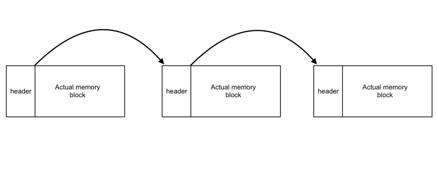

# Memory - Allocator

Project Description:
Simulated low level implementation of Heap memory Allocator. implementation models malloc(size) in C. Allocates size number of bits of memory on the heap and returns memory address of first useable block. Simulates First - Fit, Worst - Fit and Best - Fit policy of allocation with low to zero fragmentation. Memory coalescing implemented.

